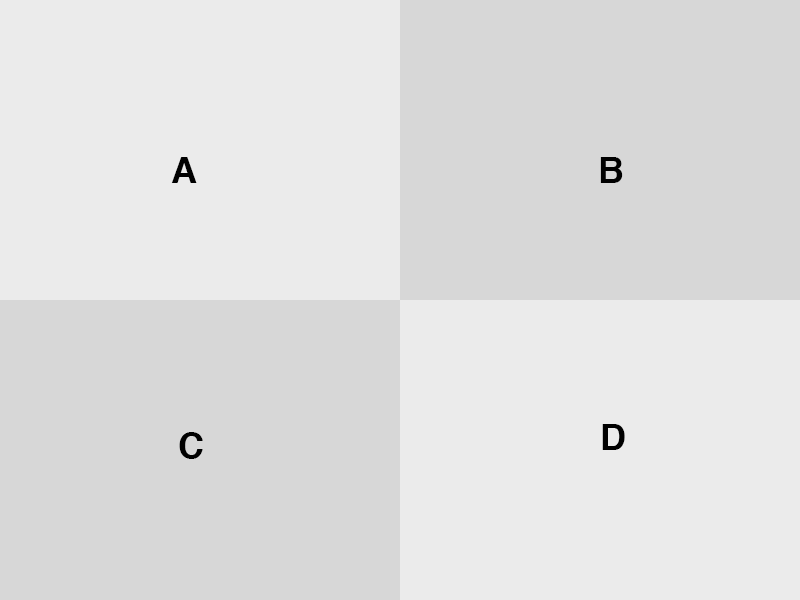

# Touchcode

Touchcode lets you easily perform custom actions after a sequence of clic / touch is executed.

## Usage

Load the script:

`<script type="text/javascript" src="path/to/touchcode.js"></script>`

And add your touchcode:

```
// Create a new Touchode instance ...
var tc = new Touchcode();
// ... and initialize it with your sequence and you callback
tc.init(['A', 'B', 'C', 'D', ...], function(){
  console.log('Touchcode: You did it !');
});
```

Zones are set up like this:


## Documentation

<a name="Touchcode+init"></a>
### touchcode.init(sequence, callback)
Initilization of the Touchcode.

| Param | Type | Description |
| --- | --- | --- |
| sequence | <code>Array</code> | Sequence to execute. |
| callback | <code>function</code> | The callback function to be executed when the sequence is over. |

<a name="Touchcode+zone"></a>
### touchcode.zone(x, y) ⇒ <code>String</code> &#124; <code>null</code>
Zone detection function

**Returns**: <code>String</code> &#124; <code>null</code> - Will return the String associated to the current zone where the event was triggered. Will return null if x or y are not numbers.

| Param | Type | Description |
| --- | --- | --- |
| x | <code>Number</code> | clientX |
| y | <code>Number</code> | clientY |

## TODO
  * Define custom touch point with a custom padding.
  * Implement a timeout to reset the counter.
